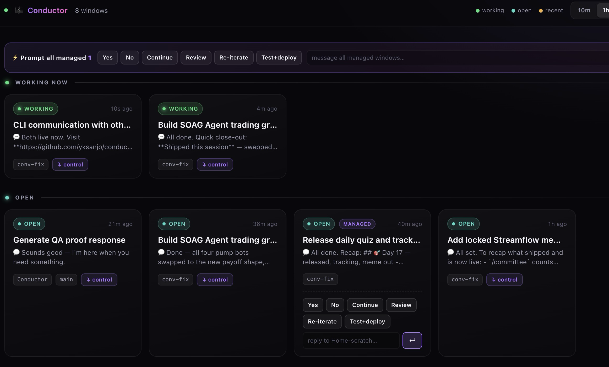
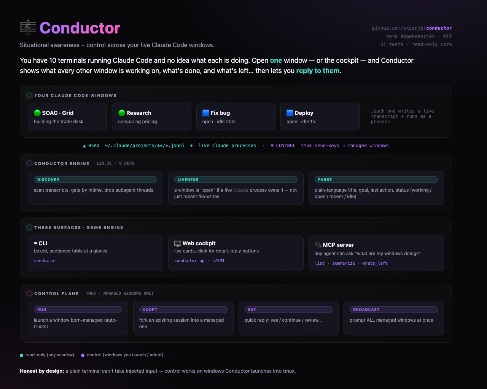

# 🎼 Conductor

**Situational awareness across your live Claude Code sessions.**



You've got 10 terminals running Claude Code. You lose track of what each one is doing.
Open a fresh window and ask Conductor to sort them out:

```
🎼 Conductor — 3 windows · last 1h
   cockpit: conductor up   ·   control: conductor run <label> / conductor say <label> yes

WORKING NOW ───────────────────────────────────────────────────────────
┌─ 1d177c35 ──────────────────────────────────────────────────────────┐
│ ● Build SOAG Agent trading grid with character art  conv-fix · 4s ago │
│ SOAG · Grid                                                          │
│ › Read: src/characters.js                                            │
└──────────────────────────────────────────────────────────────────────┘

OPEN ──────────────────────────────────────────────────────────────────
┌─ ede6faa0 ──────────────────────────────────────────────────────────┐
│ ● Tech week NYC schedule planning                      main · 17h ago │
│ Good Rooms                                                           │
│ › Done. Here's what I built…                                         │
└──────────────────────────────────────────────────────────────────────┘
```

Each window is a box that **leads with what it's actually about** (the session's own
summary), grouped into **Working now / Open / Recently active / Idle**. Open the visual
version with `conductor up`.

No new infrastructure. Conductor reads the transcript that every Claude Code session
**already writes** to `~/.claude/projects/`. It's **read-only** — it never touches,
writes to, or interrupts a running session. Zero dependencies.

## How it works

Every Claude Code window logs a live `.jsonl` transcript under
`~/.claude/projects/<dir>/<session-id>.jsonl`. Conductor:

1. Lists those transcripts and **filters by modification time** (folders hold thousands
   of historical sessions — only recently-touched ones are candidates).
2. **Excludes subagent threads** (`/subagents/`, sidechains) so each window counts once.
3. **Groups by session id** and streams each file (never loads 8MB into memory),
   pulling each session's `ai-title`, latest prompt, recent tool calls, and last action.
4. Reports one row per window.

## 🗺 The whole thing on one page



## Install

```bash
git clone <repo> ~/conductor && cd ~/conductor && npm link
```

`npm link` puts a global `conductor` command on your PATH. No build, no dependencies.

## Usage

One command, three modes:

```bash
conductor              # glance: table of your live windows
conductor up           # launch the visual web cockpit (opens your browser)
conductor mcp          # run the MCP server (for agent integration)
conductor help         # all options
```

### Table options

```bash
conductor --minutes 60   # widen the time window
conductor ls --all       # every session, ignore the filter
conductor ls --json      # structured JSON
```

### Web cockpit (the visual)

A live, glanceable dashboard. Big friendly label per window, color-coded status
(🟢 working now · 🟡 idle), click a card for full detail (goal, last action, recent
timeline). Auto-refreshes every 4s. Read-only.

```bash
conductor up                # starts on :7591 and opens your browser
conductor up --port 8080    # custom port
conductor up --no-open      # don't auto-open
```

### Custom labels (the "key")

The big label on each card comes from the working directory, auto-prettified. To give a
project a human name, edit `~/.conductor/labels.json` — a flat map of
`<dir-basename>` → `<friendly name>`:

```json
{
  "agentsoag": "SOAG · Website",
  "inmusic-pitch": "inMusic · Pitch",
  "survivors": "DegenScreener"
}
```

Changes are picked up live (no restart). Unmapped projects fall back to a prettified
directory name.

### As a Claude Code skill (recommended)

Install the skill so any window can summarize the others in natural language:

```bash
mkdir -p ~/.claude/skills/conductor
cp skill/SKILL.md ~/.claude/skills/conductor/SKILL.md
```

Then in any Claude Code session: **"sort out my windows"** / **`/conductor`**. Claude
runs the scanner and renders a *doing-now / done / what's-left* summary per window.

### As an MCP server (use it inside any agent)

Conductor speaks the Model Context Protocol over stdio, so any MCP-aware agent can call
it natively. Three tools: `list_sessions`, `summarize_session`, `whats_left`.

Add it to Claude Code (user scope = available everywhere):

```bash
claude mcp add conductor --scope user -- node ~/conductor/mcp.js
```

Or add it by hand to a client config (e.g. Claude Desktop `claude_desktop_config.json`):

```json
{
  "mcpServers": {
    "conductor": { "command": "node", "args": ["/Users/you/conductor/mcp.js"] }
  }
}
```

Then in any session: *"use conductor to list my sessions"* / *"what's left across my windows?"*

## Control — reply to managed windows

Conductor can also *steer* windows, not just watch them. Because a plain-terminal Claude
TUI can't have input injected, control works on **managed** windows — ones you launch
through Conductor into a [tmux](https://github.com/tmux/tmux) session:

```bash
conductor run soag            # launch a managed Claude window labelled "soag" (in tmux)
conductor adopt <id> soag      # take an EXISTING session under management (see below)
conductor say soag yes         # send a quick reply
conductor say soag "review and test it before deploying"
conductor attach soag          # drop into the window to type longer commands
conductor managed              # list managed windows
conductor stop soag            # close it
```

In the **cockpit**, managed windows get a `MANAGED` badge and a reply bar — one-tap
**Yes / No / Continue / Review / Re-iterate / Test+deploy** plus a free-text box. Clicks
send keystrokes straight into the live window.

Quick replies are short by design. For long, complex instructions, `conductor attach` and
type in the window directly. Requires `tmux` (`brew install tmux`).

### Adopting an existing window

A Claude window you opened yourself (in a plain terminal) can't be controlled — the OS
won't let anything inject input into it. `conductor adopt` works around this by **forking
the session into a managed tmux window**, keeping the full history:

```bash
conductor ls                  # find the session (note its 8-char id or label)
conductor adopt 1a2b3c4d work  # re-open it (forked) as managed window "work"
# ...then close the original tab; control "work" from CLI + cockpit
```

It runs \`claude --resume <id> --fork-session\` in the session's own project directory.
Forking means no collision with the still-open original — but you should close that tab and
continue in the managed window.

## Honest limits (v1)

- **Control is managed-only.** Conductor can reply to windows you launched via
  `conductor run` (tmux). Plain terminal windows you opened yourself stay read-only —
  there's no reliable way to inject input into them.
- **"What's left" is inferred** from the transcript, not a real todo list. Treat it as
  best-effort.
- **"Live" = recently touched.** A window that's been open but idle for hours may not
  appear (widen with `--minutes`). Per-row time shows *true* last activity.
- **Claude Code only**, local machine only.
- It only reads **your own** `~/.claude` — never another user's transcripts.

## License

MIT
